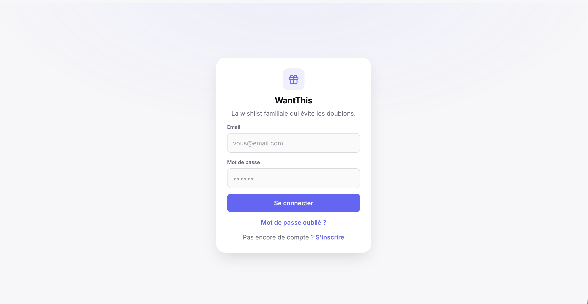
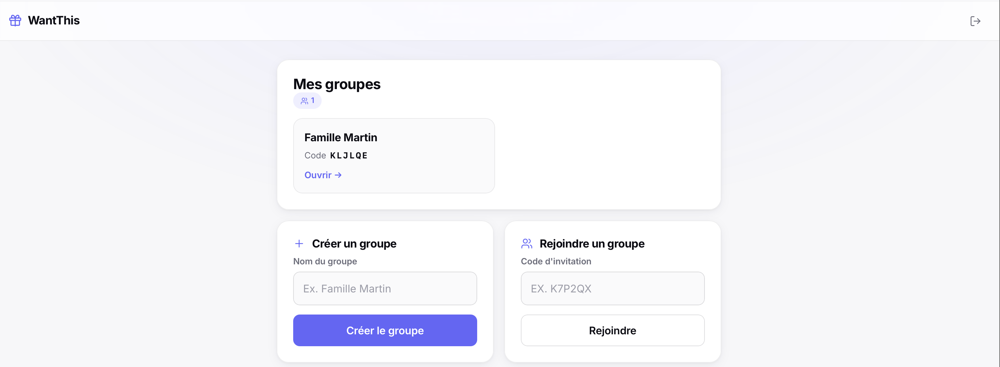
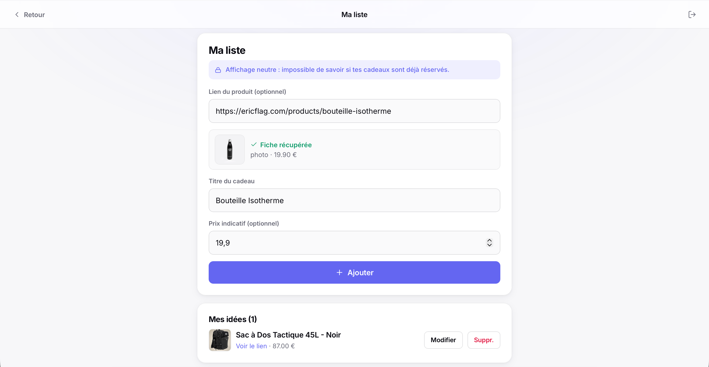

# 🎁 WantThis

Wishlist familiale partagée avec **réservation secrète** : quand tu réserves un cadeau
sur la liste d'un proche, tous les membres le voient réservé — **sauf le propriétaire de
la liste**, pour garder la surprise. La discrétion est garantie **côté serveur** par le
Row Level Security de PostgreSQL (impossible à contourner depuis le navigateur).

- **Frontend** : Vanilla JS + [Vite](https://vitejs.dev/), 100 % statique, PWA installable.
- **Backend** : [Supabase](https://supabase.com/) (Postgres + Auth + Realtime + RLS).
- **Hébergement** : GitHub Pages (déploiement auto via GitHub Actions).

## Aperçu

| Connexion | Mes groupes | Ma liste (import auto) |
|:---:|:---:|:---:|
|  |  |  |

## Mise en route

### 1. Supabase (à faire une fois)
1. Crée un projet sur [supabase.com](https://supabase.com).
2. **SQL Editor** → colle le contenu de [`supabase/schema.sql`](supabase/schema.sql) → **Run**.
3. **Authentication → Providers** : vérifie que *Email* est activé. Pour des tests
   rapides en famille, tu peux désactiver *Confirm email*.
4. **Settings → API** : récupère `Project URL` et la clé `anon public`.

### 2. Configuration locale
```bash
cp .env.example .env       # puis colle tes 2 valeurs Supabase dans .env
npm install
npm run dev                # ouvre http://localhost:5173/WantThis/
```

### 3. Déploiement GitHub Pages
1. Repo GitHub → **Settings → Secrets and variables → Actions** : ajoute
   `VITE_SUPABASE_URL` et `VITE_SUPABASE_ANON_KEY`.
2. **Settings → Pages** : source = *GitHub Actions*.
3. `git push` sur `main` → l'app se déploie sur
   `https://<utilisateur>.github.io/WantThis/`.

> ℹ️ Si ton repo ne s'appelle pas exactement `WantThis`, ajuste `base` dans
> `vite.config.js` et les chemins `/WantThis/` dans `index.html`, le manifest et le SW.

## Tester la réservation secrète (le point clé)
1. Crée 2 comptes (A et B), mets-les dans le même groupe (code d'invitation).
2. A ajoute un cadeau ; B le réserve.
3. Vérifie que **B** (et les autres) voient « Déjà réservé », mais que **A**
   (propriétaire) ne voit aucune trace de réservation sur sa propre liste.

## Administration (supprimer des comptes)

La suppression d'un compte d'auth exige la clé `service_role`, qui ne doit jamais
être dans le frontend. Elle est donc confiée à une **Edge Function** Supabase qui
vérifie que l'appelant est admin avant d'agir. Mise en place (3 étapes) :

1. **SQL** : exécute [`supabase/admin.sql`](supabase/admin.sql) dans le SQL Editor
   (ajoute la colonne `is_admin`), puis désigne-toi admin :
   ```sql
   update public.profiles set is_admin = true
     where id = (select id from auth.users where email = 'ton-email@exemple.com');
   ```
2. **Déploie l'Edge Function** `supabase/functions/admin/` :
   - *Soit* via le **dashboard** : Supabase → *Edge Functions* → *Create a function* →
     nomme-la `admin` → colle le contenu de `supabase/functions/admin/index.ts` → Deploy.
   - *Soit* via la **CLI** :
     ```bash
     npm i -g supabase
     supabase login
     supabase link --project-ref otpmagmyvanwwrcovejc
     supabase functions deploy admin
     ```
   Les variables `SUPABASE_URL`, `SUPABASE_ANON_KEY` et `SUPABASE_SERVICE_ROLE_KEY`
   sont injectées automatiquement dans la fonction — rien à configurer.
3. **Utilise-la** : reconnecte-toi dans l'app ; un bloc *Administration* apparaît sur
   l'écran « Mes groupes ». Tu peux y lister et supprimer des comptes (cascade sur
   leurs groupes/cadeaux/réservations).

## Import auto de la photo et du prix

Quand on colle le lien d'un produit, l'app récupère automatiquement son **titre**,
sa **photo** et son **prix**. Un frontend statique ne peut pas lire le HTML d'un
autre domaine (CORS) : c'est une **Edge Function** `unfurl` qui va chercher la page
côté serveur et en extrait les métadonnées (Open Graph, JSON-LD schema.org, et
quelques cas spécifiques décrits plus bas). Mise en place (2 étapes) :

1. **SQL** : ajoute la colonne image au schéma (déjà inclus si tu réexécutes
   [`supabase/schema.sql`](supabase/schema.sql)). Sinon, en une ligne :
   ```sql
   alter table public.gifts add column if not exists image_url text;
   ```
2. **Déploie l'Edge Function** `supabase/functions/unfurl/` (même procédure que `admin`) :
   - *dashboard* : Supabase → *Edge Functions* → *Create a function* → nomme-la
     `unfurl` → colle [`supabase/functions/unfurl/index.ts`](supabase/functions/unfurl/index.ts) → Deploy ;
   - *ou CLI* : `supabase functions deploy unfurl`.

   La fonction n'est utilisable que par un utilisateur connecté (pas de proxy ouvert).

### Sites anti-bot ou rendus en JavaScript (générique)

Certains sites échouent au chargement direct : marchands qui servent une page
anti-bot aux serveurs (Amazon, Fnac…), ou sites rendus côté client (SPA) dont les
métadonnées n'existent qu'après exécution du JS. Deux contournements **génériques** :

- **Fallback proxy (optionnel, recommandé)** — `SCRAPER_API_KEY`. Si la page directe
  est bloquée **ou incomplète** (image ou prix manquant), la fonction retélécharge
  le HTML *réel* via [ScraperAPI](https://www.scraperapi.com/), puis en extrait
  prix/photo/titre avec le même parsing. Active-le en posant le secret :
  ```bash
  supabase secrets set SCRAPER_API_KEY=ta_cle_scraperapi
  supabase functions deploy unfurl
  ```
  (ou *dashboard* → Edge Functions → `unfurl` → *Secrets*). **Sans cette clé**, seul
  le fetch direct est tenté (les sites protégés ne remontent alors pas).
  > 💡 La fonction tente d'abord les **proxies premium** (~10 crédits, requis par
  > les « domaines protégés » type Fnac/Amazon), puis n'ajoute le **rendu JS**
  > (`render=true`, ~25 crédits) que si image/prix manquent encore (vrais SPA), et
  > s'arrête dès qu'elle a tout. Tier gratuit ScraperAPI ≈ 1000 crédits/mois, large
  > pour un usage familial. **À court de crédits** (HTTP 401/403), l'app l'indique
  > et bascule en saisie manuelle sans bloquer l'ajout. N'importe quel fournisseur
  > équivalent (ScrapingBee…) se branche en changeant l'URL dans `fetchViaProxy`.
- **Photo Amazon sans scraping** : cas particulier gratuit — à défaut d'image, l'ASIN
  est lu dans l'URL (`/dp/XXXXXXXXXX`) et une image construite depuis le CDN Amazon,
  même sans clé proxy. La **vraie** photo produit (et le prix) restent toutefois
  récupérés depuis le HTML dès que le proxy est actif. **Aucune config requise.**

> Limites connues : photos stockées en lien (cassent si le site les supprime),
> prix parfois ambigu (promo/variantes), parsing dépendant du HTML des sites
> (à adapter s'ils changent), pas de cache ni de géo-ciblage (`country_code` est
> une option payante de ScraperAPI).

## Structure
```
supabase/schema.sql           Tables + fonctions + policies RLS (le cœur de la sécurité)
supabase/admin.sql            Colonne is_admin sur profiles (feature administration)
supabase/functions/admin/     Edge Function de suppression de comptes (clé service_role)
src/supabase.js               Client Supabase
src/auth.js                   Inscription / connexion / session
src/store.js                  État global (user, profile) + helpers (app, esc, initials)
src/api.js                    Accès données (groupes, cadeaux, réservations, realtime, admin)
src/router.js                 Routeur hash minimal
src/main.js                   Bootstrap, routes, garde d'auth, enregistrement du SW
src/views/                    Écrans : login, groups, dashboard, myList, memberList, admin
src/views/layout.js           Coquille commune (en-tête, navigation)
public/                       Manifest PWA, service worker, icônes
scripts/gen-icons.mjs         Génère les icônes PNG
```
